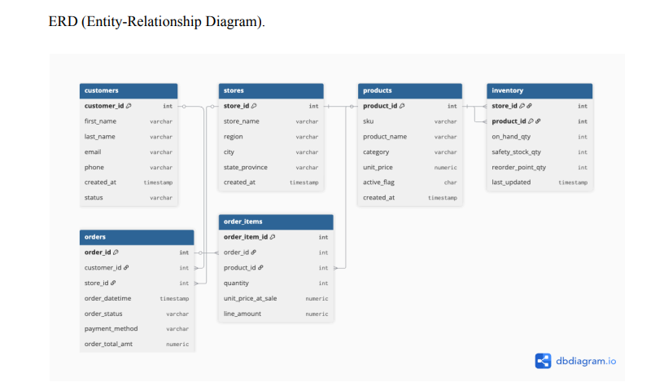
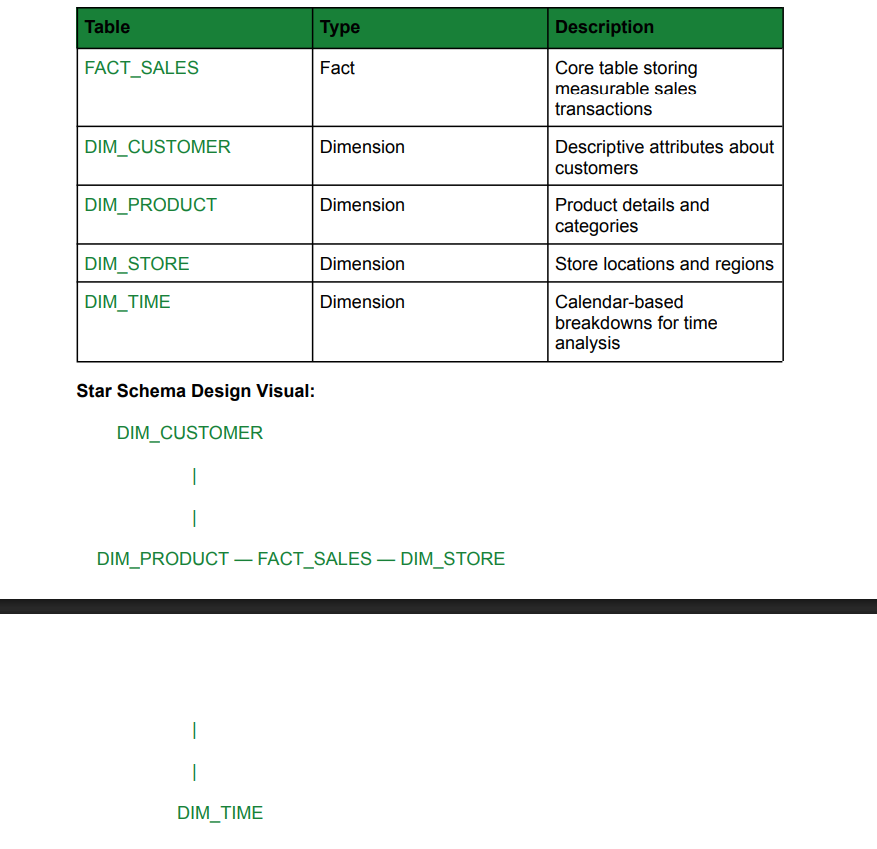

# Smart Retail Analytics Hub (Oracle 23ai)

## Overview
Smart Retail Analytics Hub is a hybrid data platform built in **Oracle 23ai** that integrates:
- **OLTP** (normalized transactional system)
- **OLAP** (Star Schema for analytics)
- **JSON Relational Duality Views** (document-style access without duplicating data)

It supports real-time retail transactions while enabling fast, multidimensional reporting for business intelligence and AI-ready use cases.

## Architecture (High Level)
- **OLTP (3NF):** Customers, Orders, Products, Stores, Inventory + constraints/triggers for data integrity and automation.
- **OLAP (Star Schema):** `FACT_SALES` connected to `DIM_CUSTOMER`, `DIM_PRODUCT`, `DIM_STORE`, `DIM_TIME`.
- **JSON Layer:** JSON tables + Duality Views to bridge relational and document access.

## Visuals
### OLTP ERD

### OLAP Star Schema

## Deliverables
- Full report: `docs/smart-retail-final-report.pdf`

## Tools
Oracle 23ai • SQL • PL/SQL • Dimensional Modeling (Star Schema) • JSON Duality Views

## Author
Preciosa Muujiza Ngoy Kalumba
